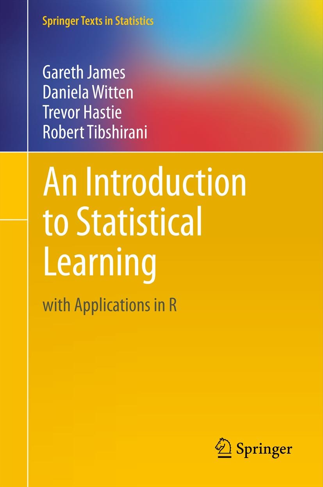

I've been on a bit of a learning binge recently and I've found that probably the most difficult thing when trying to learn something new is to find a resource that works for you. The second most difficult thing is to then actually stick with it and not get distracted by all those other amazing books and courses out there! 

Everyone's learning path is different, so this isn't one of those clickbaity articles with a list of "The Best Statistics and Data Science Books Everyone Must Read". Find the resources that are right for you! I just want to give a shout-out to some of the books I've loved that have really helped me learn some pretty cool stuff.

In no particular order, here are some of my favourite books for learning statistics and data science.

## R for Data Science
#### Hadley Wickham, Garret Grolemund

{width=150px}

If I were to get started with R today, I would like to think I'd use *R for Data Science* to learn how to analyse and visualise my data.

This book is a great introduction to the [tidyverse](https://www.tidyverse.org/), a collection of R packages for data analysis and visualisation with the same underlying design philosophy and grammar. 

The book is freely availabe [online](https://r4ds.had.co.nz/), although you can of course also buy a hard copy. Another thing that's great about this resource is the community that comes with it. You can join an [online learning community](https://www.rfordatasci.com/) to improve your R skills with other learners. 

There is no better way than learning R than by actually using it. When I first started, I didn't actually have any data yet! I think I spent weeks trying to remember how to read in a data file. The [\@R4DScommunity](https://twitter.com/r4dscommunity) posts a new data set every week for people to practice their data wrangling and visualisation skills ([check out #Tidy Tuesday](https://github.com/rfordatascience/tidytuesday)).

## Statistical Rethinking
#### Richard McElreath

{width=150px}

Getting to grips with Bayesian statistics had been on my to do list for a while and I explored different resources before finally landing on this fantastic book after several people (rightfully) recommended it to me. I think [*Statistical Rethinking*](https://xcelab.net/rm/statistical-rethinking/) is probably one of the best statistics books I have ever read! 

I can highly recommend reading this book as part of Richard McElreaths's *Statistical Rethinking* course, which is freely available on [YouTube](https://www.youtube.com/channel/UCNJK6_DZvcMqNSzQdEkzvzA/playlists). 

The book, and course, are so much more than *just* an introduction to Bayesian statistics. I learnt a lot about model building and causal inference. Even if you don't much care for Bayesian statistics, *Statistical Rethinking* is worth a read and/or watch. True to the book's name, it really made me rethink things.

The course materials, including weekly homework assignments, are available on [GitHub](https://github.com/rmcelreath/statrethinking_winter2019) and are a great way to put the things you learn into practice. And if R isn't your cup of tea, the book has been translated into other programming languages too!

## An Introduction to Statistical Learning
#### Gareth James, Daniela Witten, Trevor Hastie, Robert Tibshirani

{width=150px}

This book is another gem! *An Introduction to Statistical Learning* provides a great theoretical and practical introduction to machine learning and is [freely available online](http://faculty.marshall.usc.edu/gareth-james/ISL/ISLR%20Seventh%20Printing.pdf). The book largely focuses on supervised learning methods such as regression and classification, but also has a chapter on unsupervised learning . 

For me, the book really demystified *"machine learning"*. It took my regression analysis to the next level by introducing me to concepts such as cross-validation and shrinkage, and giving me the tools to apply this in my own research by providing the necessary R code. However, I think what stuck with me most was the notion of the trade-off between prediction accuracy and model interpretability.

The book is largely based on another amazing book, [*The Elements of Statistical Learning: Data Mining, Inference, and Prediction*](https://web.stanford.edu/~hastie/ElemStatLearn/printings/ESLII_print12.pdf), by Trevor Hastie, Robert Tibshirani, and Jerome Friedman. This book is definitely a lot more technical though, so I tend to dip in and out and use it more as a reference. 
 
